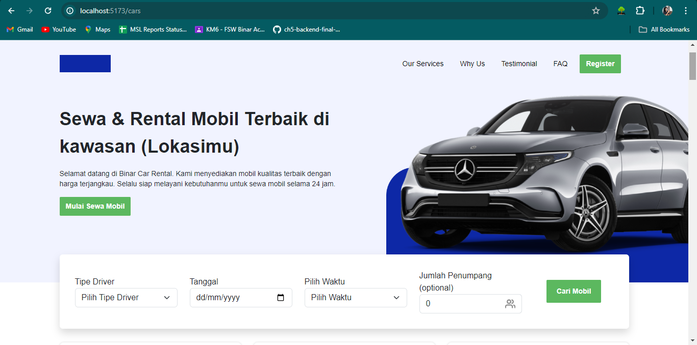

# React + Vite

This template provides a minimal setup to get React working in Vite with HMR and some ESLint rules.

Currently, two official plugins are available:

- [@vitejs/plugin-react](https://github.com/vitejs/vite-plugin-react/blob/main/packages/plugin-react/README.md) uses [Babel](https://babeljs.io/) for Fast Refresh
- [@vitejs/plugin-react-swc](https://github.com/vitejs/vite-plugin-react-swc) uses [SWC](https://swc.rs/) for Fast Refresh

## Running Tests

To run, run the following command

```bash
  npm run dev
```

# Data Diri

|                  |                          |
| ---------------- | ------------------------ |
| Kelas            | **FSW 1**                |
|                  |                          |
| Nama Peserta     | **Muh Syahri Romadhoni** |
| ID Fasil         | **F-FSW24001086**        |
| Nama Fasilitator | **Imam Taufiq Hermawan** |
|                  |                          |

## Screenshots

